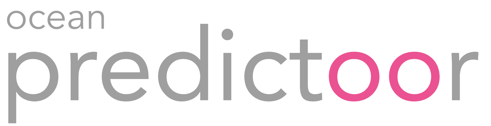
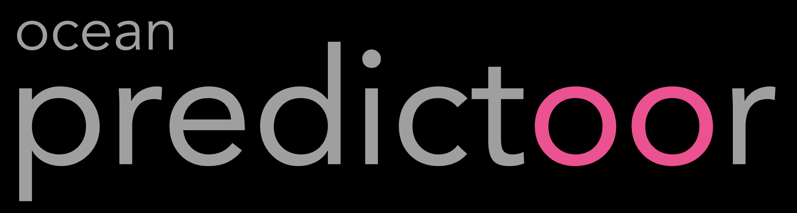
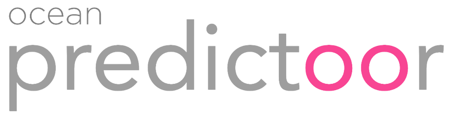
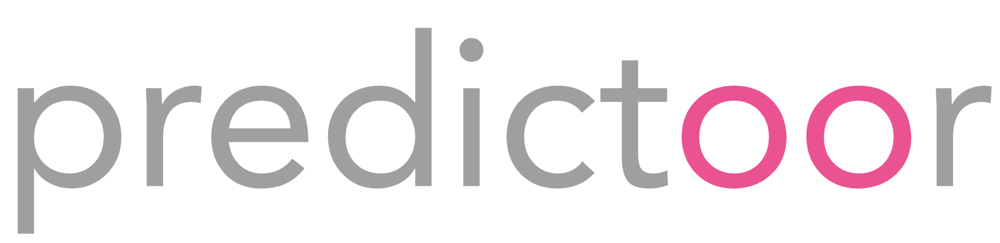

# Ocean Predictoor Logos

### Png Logo, including "Ocean"

### Png Logo, without "Ocean"

### Png Favicon

### SVG versions

### Gslides versions

[Here](https://docs.google.com/presentation/d/18D5b16p9re0g-IyZ5h0Db3Qb9zcLcmJGg4NwalN2h3g/edit#slide=id.g20f5357f625_0_1666)

## License

All assets are licensed under a [Creative Commons Attribution 4.0 International License](http://creativecommons.org/licenses/by/4.0/).

## Related

[github.com/oceanprotocol/art](https://github.com/oceanprotocol/art) is the main repo for Ocean Protocol logos & related brand assets.